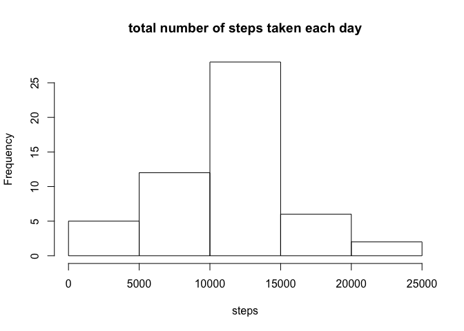
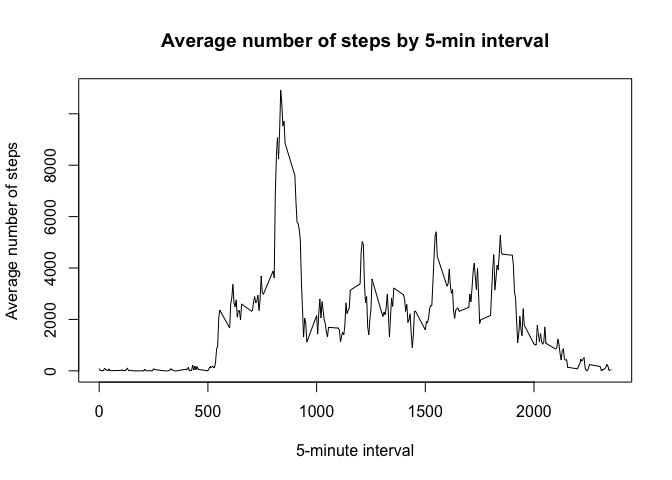
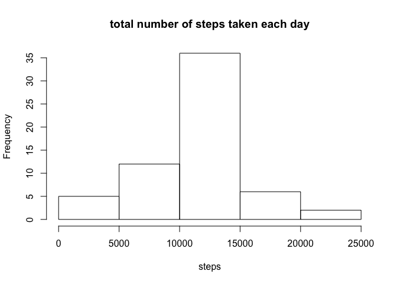
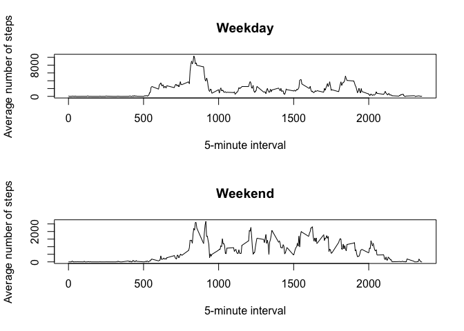
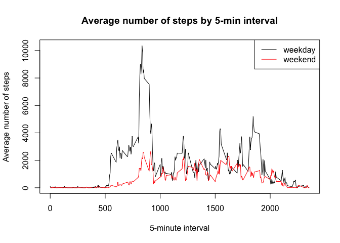

# Reproducible Research: Peer Assessment 1


## Loading and preprocessing the data


```r
data = read.csv("activity.csv")
```

## What is mean total number of steps taken per day?

Calculate the total number of steps taken per day

```r
my_steps_sum = tapply(data$steps,data$date,sum)
```

Make a histogram of the total number of steps taken each day

```r
hist(my_steps_sum,main="total number of steps taken each day",xlab="steps")
```



Calculate and report the mean and median of the total number of steps taken per day

```r
c(mean=mean(my_steps_sum,na.rm=T),median=median(my_steps_sum,na.rm=T))
```

```
##     mean   median 
## 10766.19 10765.00
```

## What is the average daily activity pattern?
Make a time series plot (i.e. 𝚝𝚢𝚙𝚎 = "𝚕") of the 5-minute interval (x-axis) and the average number of steps taken, averaged across all days (y-axis)


```r
my_steps_interval = tapply(data$steps,data$interval,sum,na.rm=T)
plot(as.numeric(names(my_steps_interval)),
     my_steps_interval,
     type="l",
     main="Average number of steps by 5-min interval",xlab="5-minute interval",ylab="Average number of steps")
```




Which 5-minute interval, on average across all the days in the dataset, contains the maximum number of steps?

```r
data$interval[which(my_steps_interval == max(my_steps_interval))]
```

```
## [1] 835
```

## Imputing missing values

Note that there are a number of days/intervals where there are missing values (coded as 𝙽𝙰). The presence of missing days may introduce bias into some calculations or summaries of the data.

Calculate and report the total number of missing values in the dataset (i.e. the total number of rows with 𝙽𝙰
s)

```r
sum(is.na(data$steps))
```

```
## [1] 2304
```


We replace the missing steps data, by the mean for that same time 5-minute interval and create a corrected data table: **data_c**


```r
data_c = data
for(i in which(is.na(data_c$steps)==T)){
    data_c$steps[i] = mean(data$steps[data$interval == data$interval[i]],na.rm=T)
}
```

Make a histogram of the total number of steps taken each day and Calculate and report the mean and median total number of steps taken per day. 


```r
my_steps_sum_c = tapply(data_c$steps,data_c$date,sum)
hist(my_steps_sum_c,main="total number of steps taken each day",xlab="steps")
```



```r
c(mean=mean(my_steps_sum_c),median=median(my_steps_sum_c))
```

```
##     mean   median 
## 10766.19 10766.19
```

From the histogram we observe a more centralized distribution with less extrems values and and both an increasing of the **mean** and **median** number of daily steps


## Are there differences in activity patterns between weekdays and weekends?

For this part the 𝚠𝚎𝚎𝚔𝚍𝚊𝚢𝚜() function may be of some help here. Use the dataset with the filled-in missing values for this part.

Create a new factor variable in the dataset with two levels – “weekday” and “weekend” indicating whether a given date is a weekday or weekend day.


```r
data_c$date = as.Date(data_c$date)
data_c$weekdays = weekdays(data_c$date)
data_c$weekpart = "weekday"
data_c$weekpart[which(weekdays(data_c$date) == "Dimanche" | weekdays(data_c$date) == "Samedi")] = "weekend"
data_c$weekpart = as.factor(data_c$weekpart)
```
Make a panel plot containing a time series plot (i.e. 𝚝𝚢𝚙𝚎 = "𝚕") of the 5-minute interval (x-axis) and the average number of steps taken, averaged across all weekday days or weekend days (y-axis). See the README file in the GitHub repository to see an example of what this plot should look like using simulated data.


```r
my_steps_interval_weekend = tapply(data_c$steps[data_c$weekpart == "weekend"],
                                   data$interval[data_c$weekpart== "weekend"],sum,na.rm=T)
my_steps_interval_weekday = tapply(data_c$steps[data_c$weekpart == "weekday"],
                                   data$interval[data_c$weekpart== "weekday"],sum,na.rm=T)
```
two panel graphs

```r
par(mfrow=c(2,1))
plot(as.numeric(names(my_steps_interval_weekday)),my_steps_interval_weekday,
     type="l",
     main="Weekday",xlab="5-minute interval",ylab="Average number of steps")
plot(as.numeric(names(my_steps_interval_weekend)),my_steps_interval_weekend,
     type="l",
     main="Weekend",xlab="5-minute interval",ylab="Average number of steps")
```



alternative graph 


```r
par(mfrow=c(1,1))
plot(as.numeric(names(my_steps_interval_weekday)),
     my_steps_interval_weekday,
     type="l",
     ylim=c(0,max(c(my_steps_interval_weekday,my_steps_interval_weekend))),
     main="Average number of steps by 5-min interval",xlab="5-minute interval",ylab="Average number of steps")
lines(as.numeric(names(my_steps_interval_weekend)),my_steps_interval_weekend,col=2)
legend("topright",c("weekday","weekend"),lty=1,col=c(1,2))
```




